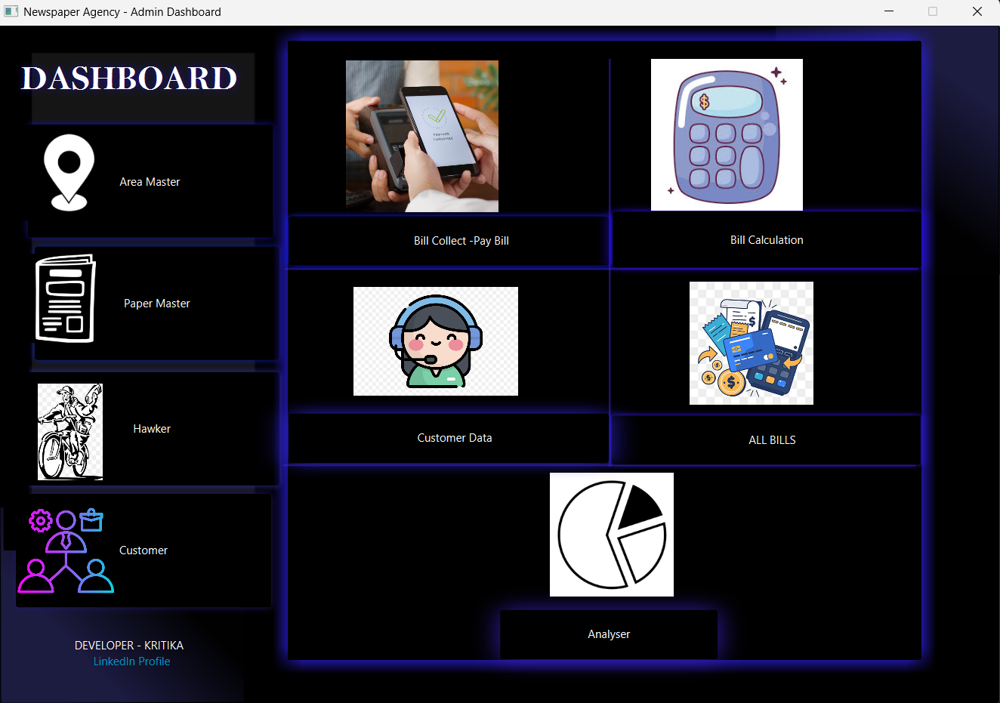
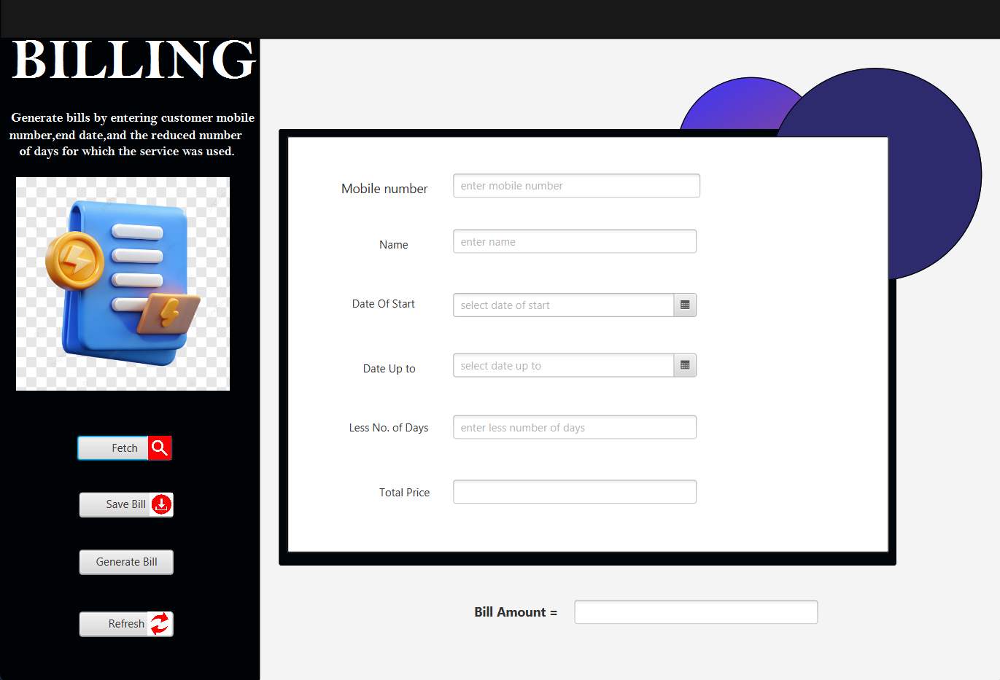

# 📰 Newspaper Agency Management System

A professional Desktop Application built to automate the daily operations of a Newspaper Agency.

## ✨ Features
* **Dashboard & Area Master:** Manage delivery routes.
* **Customer & Hawker Enrollment:** Track subscribers and delivery staff.
* **Smart Billing:** Automated monthly bill calculation.
* **Data Visualization:** Charts for business analysis.

## 🛠️ Tech Stack
* **Language:** Java 
* **Frontend:** JavaFX & Scene Builder (FXML)
* **Database:** MySQL
* **IDE:** IntelliJ IDEA

---

## 📸 Project Interface

Here are some glimpses of the system:

<table>
  <tr>
    <td><b>Dashboard</b> </td>
    <td><b>Sign Up Page</b> </td>
  </tr>
  <tr>
    <td><b>Customer Enrollment</b> </td>
    <td><b>Billing Section</b> </td>
  </tr>
  <tr>
    <td><b>Customer Board</b> </td>
    <td><b>Hawkers Console</b> </td>
  </tr>
  <tr>
    <td><b>Paper Master</b> </td>
    <td><b>Billing Board</b> </td>
  </tr>
</table>

---

## 👩‍💻 Developer Information
* **Name:** Kritika
* **Role:** Java Developer / Student
* **LinkedIn:** [kritika-33312b278](https://www.linkedin.com/in/kritika-33312b278/)
* **GitHub:** [kritika385](https://github.com/kritika385)

